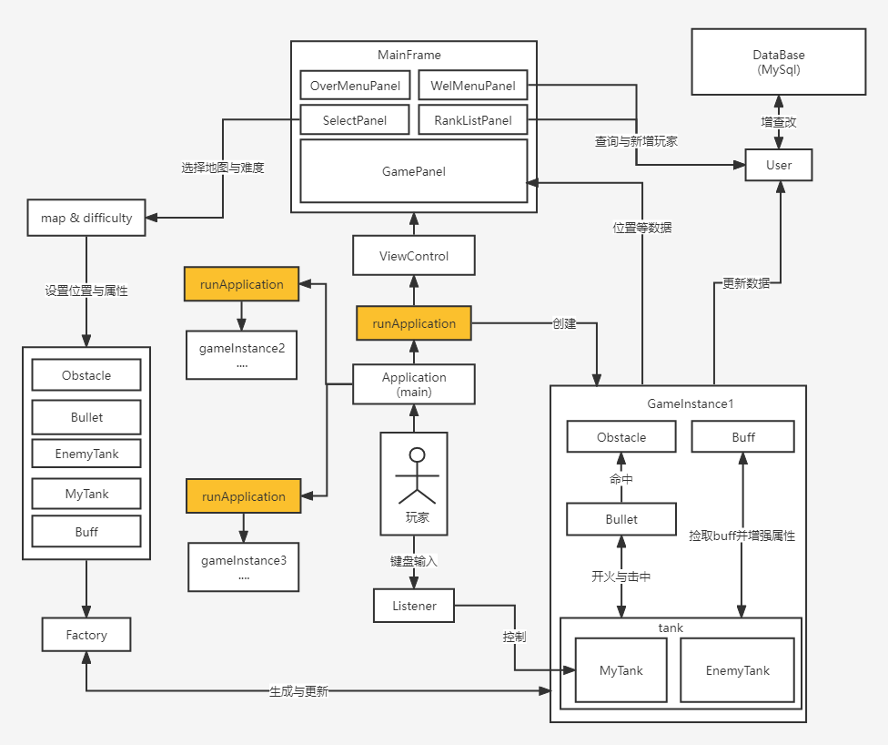

# TankGame

## 示例图片

## 项目介绍

### 项目结构

- group

  - Application：包含程序入口和游戏整体流程			

  - Attributes：包含程序设定的单位规范

  - map：包含地图生成相关的类以及地图数据

  - control：游戏运行过程中的视图控制切换，监听器，工厂模式生成
  - view：游戏运行中的各种视图：主菜单，难度地图选择，游戏主页面，游戏结算，排行榜

  - model		
    - model.pojo：坦克，子弹等实体类
    - model.util：各种碰撞检测，方向切换等工具类

  - database:采用Mybatis框架与mysql数据库交互
    - dao：利用Mapper封装对数据库的访问
    - pojo：用户实体类
    - util：Mybatis工具类和增删改查方法

- resource：包含数据库交互用到的配置文件，游戏所需的贴图

### 项目核心内容

#### 坦克

所有坦克可以与游戏单位进行相互碰撞检测，敌方坦克会自动寻找玩家，并攻击玩家。

#### 平滑移动

人物在拐角处移动的时候经常不是刚好对齐的状态，程序会判定玩家碰撞了障碍物所以导致玩家无法拐弯。所以我们在处理这种情况的时候，会让玩家进行平滑的移动使得玩家看上去是滑进去的，增强玩家游戏体验

#### 碰撞检测

不同于常见的重叠型碰撞检测，此游戏程序会根据坦克下一步移动的预测结果来判定是否会产生碰撞，来限制坦克前进的方向，使游戏拥有更好的手感，并尽可能防止穿模

#### 自动寻路

通过 A* 算法查找路径，并让所有敌方坦克寻找玩家

#### 其它特性

-  道具（Buff）
-  显示玩家坦克状态（道具等）
-  游戏介绍与帮助

### 项目亮点

#### 登录与排行榜

- 玩家可以选择使用用户名登录/注册，或者离线游玩

- 采用比较常用的Mybatis框架，轻量代码实现与mysql数据库交互，并根据玩家选择，显示出对应的排行榜

#### 算法引入

敌方坦克自动寻路通过 A* 算法查找路径，并灵活控制算法调用

#### 玩法多样

允许玩家自主选择挑战难度和地图，增加了游戏的乐趣与多样性，进一步通过排行榜来让玩家有动力玩

### 项目架构图

## 使用

### exe文件

>  本项目的压缩包自带 JRE 环境，无需额外配置

- 链接：https://pan.baidu.com/s/1AjXn_bwx2hmNUvrwgez_SA?pwd=1234
  提取码：1234

- 运行TankGame.exe文件

### 项目文件

如果您是想获取该项目源代码进行参考、学习或者修改，可以按以下步骤进行

1. 使用git克隆或直接下载该项目
2. 使用`IntelliJ IDEA`等导入该Java项目
3. 推荐使用 jdk1.8 进行编译
4. 编译并运行`Application.java`游戏入口文件

### 改善该项目

如果你有对该项目的建议，欢迎你提出[Issues](https://github.com/Simonnop/TankGame/issues)，告知我们

## 更新

更新记录，以及各版本查看[Releases](https://github.com/Simonnop/TankGame/releases)

## 声明

该项目仅是课程项目，没有参与任何商业行为。

游戏中贴图部分来自 Unity Assert Store 并遵守 [标准的Unity资源商店EULA](https://unity3d.com/legal/as_terms)

**若该项目侵权请务必通知我们删除该项目！**

## 许可

[Apache License 2.0](https://github.com/Simonnop/TankGame/blob/main/LICENSE)